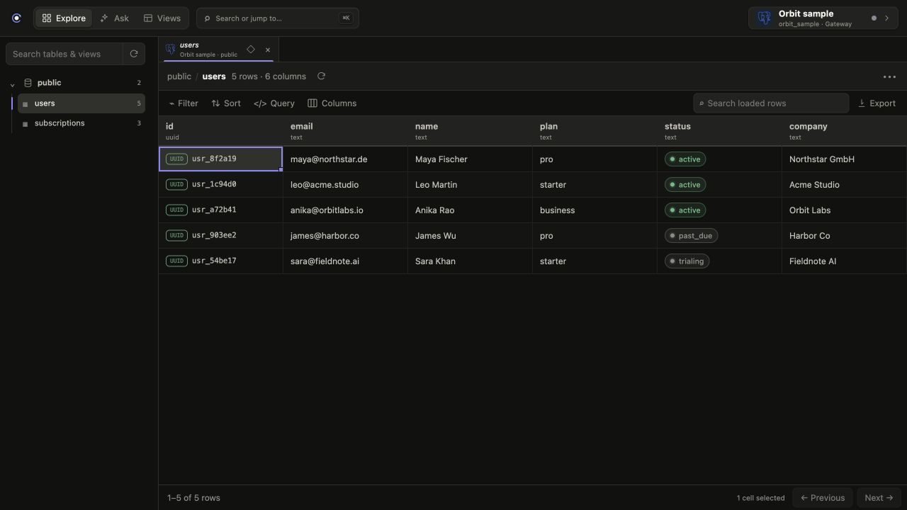
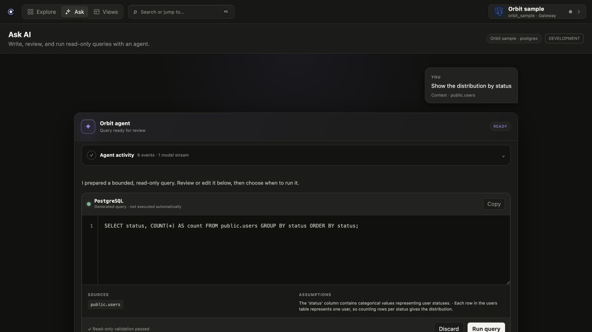
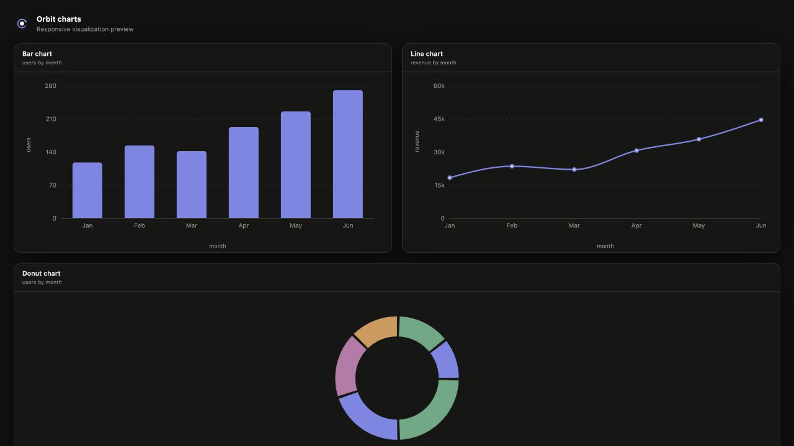

# Orbit

**An AI-native database client for exploring data, asking complex questions, and turning answers into reusable dashboards.**

Orbit brings direct database exploration, an AI data agent, and lightweight business intelligence into one cross-platform workspace. Connect MongoDB, PostgreSQL, or MySQL; navigate data manually with developer-friendly controls; ask questions in natural language; inspect and run the generated queries; visualize the results; and save useful charts as dashboards.

The desktop app is available for macOS, Windows, and Linux. A mobile experience is planned so you can securely interact with your data away from your desk.



<p align="center"><sub>Explore tables and collections with keyboard navigation, typed values, filters, sorting, and linked records.</sub></p>

## Why Orbit?

Database tools usually force you to choose between two extremes:

- A developer client gives you precise access, but expects you to manually inspect tables, documents, and query results.
- A BI tool gives you dashboards, but adds another product, another data model, and another setup workflow.
- A generic AI assistant can write a query, but often hides its reasoning, lacks database context, or runs outside the workflow where you inspect your data.

Orbit treats these as different ways of exploring the same data—not separate products.

You can start with a collection or table, move through it entirely from the keyboard, ask an agent to investigate a harder question, review the exact query it generated, and turn the result into a chart or saved dashboard. The goal is to shorten the path from **“I wonder why this happened”** to a trustworthy, reusable answer.

## Who is Orbit for?

Orbit is designed for people who work close to production data:

- **Developers** debugging application state, inspecting relationships, and validating migrations or integrations.
- **Founders and operators** answering product and business questions without waiting for a separate analytics workflow.
- **Data and product teams** exploring unfamiliar datasets, testing hypotheses, and sharing lightweight views.
- **Small teams** that want database exploration and operational dashboards without maintaining a full BI stack.

Orbit is especially useful when the question starts simple but the investigation does not.

## Explore data your way

### 1. Manual and developer-friendly

Browse databases, schemas, tables, and collections directly. Orbit is keyboard-first across its core workflows, with command-palette navigation, arrow-key table movement, cell selection and copying, pinned and hidden columns, filtering, sorting, pagination, exports, and inspectable nested values.

Database-aware formatting makes raw data easier to understand: ObjectIds, dates, JSON, enums, statuses, foreign keys, and linked records are rendered as useful interactive values rather than undifferentiated strings.

### 2. Ask an AI data agent

Ask questions in natural language when manual exploration becomes slow or the query becomes complex. Orbit gives the agent database-specific schema context, including profiled nested MongoDB fields and low-cardinality enum-like values.

The agentic flow stays inspectable:

1. Orbit prepares relevant schema context.
2. The agent generates a typed, read-only query plan.
3. You see the exact SQL or MongoDB aggregation before it runs.
4. You can review or edit the query and explicitly approve execution.
5. Orbit returns the evidence, timing, result set, and an evidence-backed answer.

The query is part of the product experience—not a hidden implementation detail behind a loading spinner.



<p align="center"><sub>Ask in natural language, follow the agent's activity, and inspect or edit the generated query before it runs.</sub></p>

### 3. Visualize and save the answer

Turn query results into tables, metrics, line charts, bar charts, or donut charts. Save useful results as Views and arrange them into dashboards that can be refreshed and revisited.

For day-to-day operational questions, this closes the gap between a database client and a BI app: investigate the data, create the visualization, and keep the result in the same workspace.



<p align="center"><sub>Visualize query results and save useful answers as refreshable Views and dashboards.</sub></p>

## Product principles

- **AI-native, not AI-bolted-on.** The agent understands database structure, produces inspectable queries, and works inside the exploration loop.
- **Keyboard-first.** Common navigation, selection, search, and inspection flows should remain fast without reaching for the mouse.
- **Local where it matters.** Desktop Explore connects through native Rust database drivers, and credentials remain in the operating system credential vault.
- **Safe by default.** Queries are bounded and read-only, generated queries require review, and database accounts should use read-only grants.
- **One workspace, multiple modes.** Manual exploration, AI investigation, charts, and saved dashboards build on the same connections and data model.
- **Available beyond one platform.** Orbit ships for macOS, Windows, and Linux, with mobile access coming soon.

## What is implemented

- MongoDB, PostgreSQL, and MySQL connections.
- Native desktop connectivity through SQLx and the official MongoDB Rust driver.
- Web and remote access through an HTTPS gateway that never exposes database credentials to the browser.
- Connection testing, health, latency, encrypted gateway credential storage, and operating-system credential-vault storage on desktop.
- Lazy and cached database/schema/collection discovery with explicit refresh controls.
- Multi-tab table and collection exploration without refetching when switching between cached tabs.
- Typed filters, sorting, pagination, loaded-row search, column controls, CSV/JSON export, and document counts.
- Keyboard table navigation, cell selection and copying, and a command palette.
- Rich formatting for ObjectIds, dates, nested JSON, enums, statuses, foreign keys, and linked records.
- Linked-record inspection for MongoDB references and PostgreSQL foreign keys.
- AI query drafting with visible progress, inspect-before-run review, editable queries, assumptions, sources, evidence, and execution timing.
- Result visualization with table, metric, line, bar, and donut presentations.
- Persistent Views with dashboard layouts, refresh states, duplication, deletion, and revocable sharing.
- Signed and notarized macOS releases plus Windows and Linux installers.

Multi-user workspaces, session-based authentication, scheduled dashboard refresh, Windows code signing, and mobile workflows are still in development.

## How Orbit connects

Orbit uses different transports for local desktop exploration and remote features:

```text
Desktop Explore ── native Rust drivers ──> Database

Desktop Ask/Views ─┐
Web client ────────┼── HTTPS gateway ──> Database
Future mobile ─────┘
```

On desktop, Explore connects directly using SQLx pools for PostgreSQL/MySQL and the official MongoDB Rust driver. Credentials are stored in Keychain on macOS, Credential Manager on Windows, or Secret Service on Linux; only non-secret connection metadata is written to Orbit's app-data directory.

Ask, Views, sharing, the web app, and future mobile clients use the gateway. The browser never receives database credentials and never opens a native database socket.

## Repository structure

- `apps/client` — React + Vite client shared by the web app and Tauri desktop shell.
- `apps/client/src-tauri` — Tauri 2 desktop wrapper and native Rust command boundary.
- `apps/gateway` — HTTPS query gateway for AI, Views, sharing, web, and future mobile clients.
- `packages/contracts` — shared request, response, and database metadata types.
- `packages/database` — adapter interfaces and implementations for PostgreSQL, MySQL, and MongoDB.
- `packages/theme` — shared design tokens.

## Getting started

### Web client and gateway

```sh
pnpm install
pnpm dev
```

The client runs at `http://localhost:5173` and the gateway at `http://localhost:8787`.

With no connection configuration, the gateway exposes one visibly labelled in-memory demo connection. It contains no credentials and is intended only for local evaluation.

### Desktop app

Install the [Tauri prerequisites](https://v2.tauri.app/start/prerequisites/), including Rust, then run:

```sh
pnpm install
pnpm desktop:dev
```

Desktop Explore automatically uses the local native transport. Ask and Views use the gateway, so those features require the gateway to be running and configured.

## Configuring database connections

Open the connection switcher and choose **Add or manage connections**. New connections are tested before they are saved.

For gateway connections, public metadata and encrypted credential records are stored separately under `ORBIT_DATA_DIR` (default: `.orbit-data` in the gateway working directory). Credentials are never returned by the API.

Development creates a local encryption key with owner-only file permissions. Production requires an explicit 32-byte base64 key and API token:

```sh
export ORBIT_ENCRYPTION_KEY="$(openssl rand -base64 32)"
export ORBIT_API_TOKEN='replace-with-a-long-random-token'
export ORBIT_DATA_DIR='/var/lib/orbit'
pnpm dev
```

The file vault uses AES-256-GCM with a unique IV for every secret. Use a persistent volume and an externally managed encryption key in a single-node deployment; distributed deployments should replace the file vault with KMS-backed secret storage.

Always create database users with read-only grants. Orbit's application-level validation is defense in depth, not a substitute for database permissions.

Gateway limits default to 10 seconds, 200 rows per request, and a 2 MB serialized response. Override the time and response-size limits with `QUERY_TIMEOUT_MS` and `MAX_RESPONSE_BYTES`.

## Configuring the AI agent

Ask uses OpenRouter's OpenAI-compatible API with Structured Outputs. Configure the key only on the gateway:

```sh
export OPENROUTER_API_KEY='sk-or-v1-...'
export OPENROUTER_MODEL='openai/gpt-5.4' # optional; current default
export OPENROUTER_SITE_URL='https://orbit.example.com' # optional attribution
pnpm dev
```

For local development, these values can instead be placed in `apps/gateway/.env`. Restart the gateway after changing them.

The browser never receives the API key. Orbit sends the selected database's object and column metadata plus the user's question to OpenRouter; it does not send database credentials.

For MongoDB, the gateway builds and caches a bounded schema profile from sampled documents. The profile includes nested dotted paths, observed types, field presence, and safe low-cardinality enum candidates—but never stores the sampled raw documents. `MONGO_SCHEMA_SAMPLE_SIZE`, `MONGO_SCHEMA_PROFILE_TTL_MS`, and `ASK_SCHEMA_FIELD_LIMIT` control profiling and context size.

After you approve and run a generated query, Orbit sends up to 50 bounded evidence rows for the narrative answer. Execution repeats server-side read-only validation even if the generated query was edited.

To use another OpenAI-compatible provider, set `ORBIT_LLM_API_KEY`, `ORBIT_LLM_BASE_URL`, and `ORBIT_LLM_MODEL`.

## Security model

- Desktop database secrets live in the operating system credential vault.
- Gateway database secrets are encrypted at rest and never returned to clients.
- Database connections should use read-only users with the smallest practical scope.
- Query values are parameterized and identifiers are allowlisted.
- Query time, row count, and response size are bounded.
- AI-generated queries are drafts until explicitly approved.
- Shared-view links use 256-bit random tokens; Orbit stores only their SHA-256 hashes.
- Public shared results exclude connection references, credentials, queries, filters, assumptions, and dashboard layouts.

## Desktop releases

Pushing a semantic-version tag starts the `Desktop release` GitHub Actions workflow. It validates matching package versions, runs TypeScript and Rust checks, and builds installers for macOS Apple Silicon, macOS Intel, Windows x64, and Linux x64.

```sh
git tag v0.2.0
git push origin v0.2.0
```

Installers are published on the repository's [Releases](https://github.com/harshtomar6/orbit/releases) page after every platform succeeds.

macOS builds use a Developer ID Application certificate, Apple notarization, Gatekeeper verification, and a stapled notarization ticket. Configure the required repository secrets with:

```sh
./scripts/configure-apple-signing.sh /absolute/path/to/developer-id-application.p12
```

Windows builds are currently unsigned and may show a SmartScreen warning. Windows code signing is planned.

## Roadmap

- Mobile apps for securely asking questions and viewing operational data on the go.
- Scheduled refresh for saved dashboards.
- Multi-user workspaces and session-based authentication.
- Additional database engines and richer relationship discovery.
- Windows code signing and smoother automatic updates.

Orbit's long-term direction is simple: wherever you are, you should be able to move naturally between inspecting data yourself, delegating an investigation to an AI agent, and keeping the answer as a live visual view.
